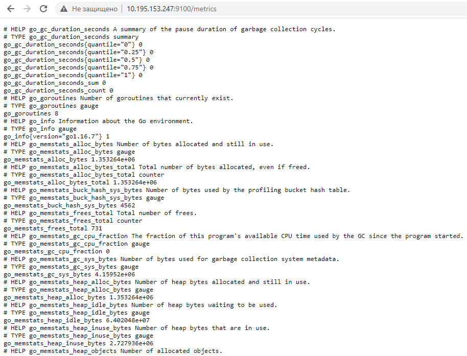
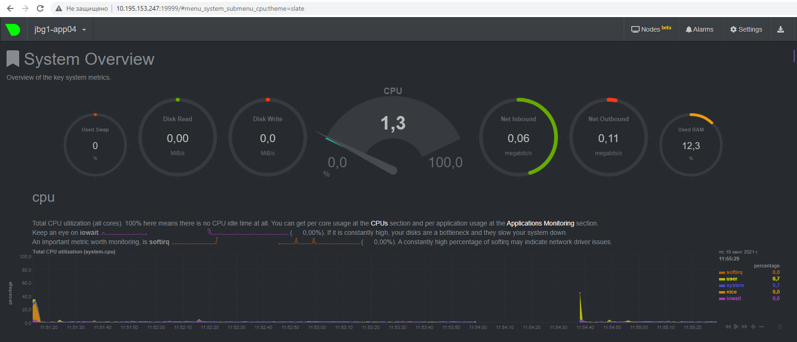

# Домашнее задание к занятию "3.4. Операционные системы, лекция 2"

1. На лекции мы познакомились с [node_exporter](https://github.com/prometheus/node_exporter/releases). В демонстрации его исполняемый файл запускался в background. Этого достаточно для демо, но не для настоящей production-системы, где процессы должны находиться под внешним управлением. Используя знания из лекции по systemd, создайте самостоятельно простой [unit-файл](https://www.freedesktop.org/software/systemd/man/systemd.service.html) для node_exporter:

    * поместите его в автозагрузку,
    * предусмотрите возможность добавления опций к запускаемому процессу через внешний файл (посмотрите, например, на `systemctl cat cron`),
    * удостоверьтесь, что с помощью systemctl процесс корректно стартует, завершается, а после перезагрузки автоматически поднимается.

***Ответ:***
<br/>
Вывод 9100 порта:


Порядок установки node_exporter:
> Добавил системного пользователя, от которого будет работать Node Exporter<br>
> `# sudo useradd -r -M -s /bin/false node_exporter`<br>
> Скачал node_exporter<br>
> `# wget https://github.com/prometheus/node_exporter/releases/download/v1.2.2/node_exporter-1.2.2.linux-amd64.tar.gz /tmp`<br>
> `# cd /tmp/`<br>
> `# tar -xzpvf node_exporter-1.2.2.linux-amd64.tar.gz`<br>
> `# cd node_exporter-1.2.2.linux-amd64/`<br>
> `# cp node_exporter /usr/local/bin`<br>
> `# chown node_exporter:node_exporter /usr/local/bin/node_exporter`

Создал Systemd Unit <br>

> `# nano /etc/systemd/system/node_exporter.service`
```
[Unit]
Description=Prometheus Node Exporter

[Service]
User=node_exporter
Group=node_exporter
Type=simple
ExecStart=/usr/local/bin/node_exporter -f $EXTRA_OPTS
EnvironmentFile=/etc/default/node_exporter

[Install]
WantedBy=multi-user.target
```

Добавил сервис в автозагрузку, запустил его, проверил статус

> `# systemctl daemon-reload`<br>
> `# systemctl enable --now node_exporter`<br>
> `# systemctl status node_exporter`

Проверка работы:

> `# ps -e |grep node_exporter`<br>
> `  33158 ?        00:00:00 node_exporter`<br>
> `# systemctl stop node_exporter`<br>
> `# ps -e |grep node_exporter`<br>
> `...`<br>
> `# systemctl start node_exporter`<br>
> `  33246 ?        00:00:00 node_exporter`

Вывод после перезагрузки:
> `# ps -e |grep node_exporter`<br>
> 750 ? 00:00:00 node_exporter

2. Ознакомьтесь с опциями node_exporter и выводом `/metrics` по-умолчанию. Приведите несколько опций, которые вы бы выбрали для базового мониторинга хоста по CPU, памяти, диску и сети.

***Ответ:***
```
CPU:
    node_cpu_seconds_total{cpu="0",mode="idle"} 272303.43
    node_cpu_seconds_total{cpu="0",mode="system"} 94.9
    node_cpu_seconds_total{cpu="0",mode="user"} 138.9

Memory:
    node_memory_MemAvailable_bytes 3.361660928e+09
    node_memory_MemFree_bytes 2.838142976e+09
    
Disk (если используется не один диск, то для каждого):
    node_disk_io_time_seconds_total{device="sda"} 229.096
    node_disk_read_bytes_total{device="sda"} 1.396988416e+09
    node_disk_read_time_seconds_total{device="sda"} 134.173
    node_disk_write_time_seconds_total{device="sda"} 123.918
    
Network (если используется несколько активных адаптеров, то для каждого):
    node_network_receive_errs_total{device="eth0"} 0
    node_network_receive_bytes_total{device="eth0"} 2.7089788e+08
    node_network_transmit_bytes_total{device="eth0"} 1.146875e+07
    node_network_transmit_errs_total{device="eth0"} 0
```

3. Установите в свою виртуальную машину [Netdata](https://github.com/netdata/netdata). Воспользуйтесь [готовыми пакетами](https://packagecloud.io/netdata/netdata/install) для установки (`sudo apt install -y netdata`). После успешной установки:
    * в конфигурационном файле `/etc/netdata/netdata.conf` в секции [web] замените значение с localhost на `bind to = 0.0.0.0`,
    * добавьте в Vagrantfile проброс порта Netdata на свой локальный компьютер и сделайте `vagrant reload`:

    ```bash
    config.vm.network "forwarded_port", guest: 19999, host: 19999
    ```

    После успешной перезагрузки в браузере *на своем ПК* (не в виртуальной машине) вы должны суметь зайти на `localhost:19999`. Ознакомьтесь с метриками, которые по умолчанию собираются Netdata и с комментариями, которые даны к этим метрикам.


***Ответ:***


Вывод:
> `# lsof -i :19999`<br>
> `netdata 2740 netdata    4u  IPv4  50306      0t0  TCP *:19999 (LISTEN)`<br>
> `netdata 2740 netdata   48u  IPv4  50486      0t0  TCP jbg1-app04:19999->JBG1WS-00050.podsvirov.ru:1373 (ESTABLISHED)`

4. Можно ли по выводу `dmesg` понять, осознает ли ОС, что загружена не на настоящем оборудовании, а на системе виртуализации?

***Ответ:***
По выводу `dmesg` можно понять, что ОС осознаёт то, что она запущена на системе виртуализации:
> `# dmesg |grep virtualiz`<br>
> `[    0.041741] Booting paravirtualized kernel on Hyper-V`<br>
> `[   17.570538] systemd[1]: Detected virtualization microsoft.`<br>

5. Как настроен sysctl `fs.nr_open` на системе по-умолчанию? Узнайте, что означает этот параметр. Какой другой существующий лимит не позволит достичь такого числа (`ulimit --help`)?

***Ответ:***
> `# /sbin/sysctl -n fs.nr_open`<br>
> 1048576

Вывод показывает максимальное число открытых дескрипторов для ядра (системы), 
для пользователя системы задать больше этого числа нельзя (если не изменять)

Максимальный предел ОС можно посмотреть так: 
> `cat /proc/sys/fs/file-max`<br>
> 9223372036854775807

-----------------------------------------------------------------------
> `# ulimit -Sn`<br>
> 1024

Мягкий лимит (так же ulimit -n) на пользователя (может быть увеличен в процессе работы)

-----------------------------------------------------------------------
> `# ulimit -Hn`<br>
> 1048576

Жесткий лимит на пользователя (не может быть увеличен, только уменьшение)

Оба ключа не могут превысить системный fs.nr_open

6. Запустите любой долгоживущий процесс (не `ls`, который отработает мгновенно, а, например, `sleep 1h`) в отдельном неймспейсе процессов; покажите, что ваш процесс работает под PID 1 через `nsenter`. Для простоты работайте в данном задании под root (`sudo -i`). Под обычным пользователем требуются дополнительные опции (`--map-root-user`) и т.д.

***Ответ:***
> `# ps -e |grep sleep`<br>
> 1061909 ?        00:00:00 sleep<br>
> `# nsenter --target 1061909 --pid --mount`<br>
> `# ps`<br>
```
    PID TTY          TIME CMD
1061749 pts/0    00:00:00 sudo
1061753 pts/0    00:00:00 bash
1061931 pts/0    00:00:00 nsenter
1061932 pts/0    00:00:00 bash
1061965 pts/0    00:00:00 ps
```
7. Найдите информацию о том, что такое `:(){ :|:& };:`. Запустите эту команду в своей виртуальной машине Vagrant с Ubuntu 20.04 (**это важно, поведение в других ОС не проверялось**). Некоторое время все будет "плохо", после чего (минуты) – ОС должна стабилизироваться. Вызов `dmesg` расскажет, какой механизм помог автоматической стабилизации. Как настроен этот механизм по-умолчанию, и как изменить число процессов, которое можно создать в сессии?

***Ответ:*** <br>
Из предыдущих лекций ясно что это функция внутри "{}", судя по всему с именем ":", которая после определения в строке запускает саму себя.
Все что внутри помог поисковик, пораждает два фоновых процесса самой себя, получается бинарное дерево плодящее процессы
А функция судя по всему это:
```
[ 3099.973235] cgroup: fork rejected by pids controller in /user.slice/user-1000.slice/session-4.scope
[ 3103.171819] cgroup: fork rejected by pids controller in /user.slice/user-1000.slice/session-11.scope
```

Судя по всему, система на основании этих файлов в пользовательской зоне ресурсов имеет определенное ограничение на создаваемые ресурси 
и соответсвенно при превышении начинает блокировать создание числа 

Если установить ulimit -u 50 - число процессов будет ограниченно 50 для пользоователя. 