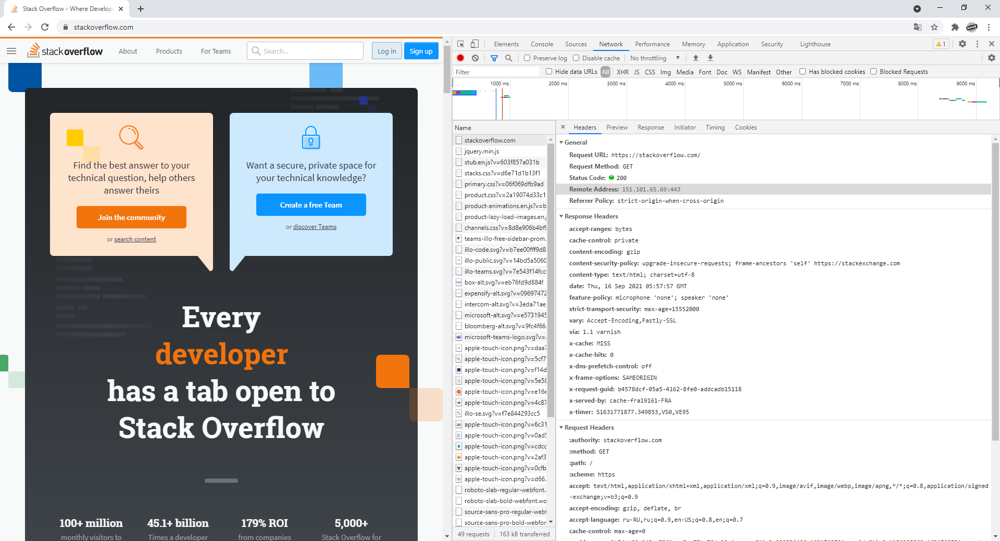

# Домашнее задание к занятию "3.6. Компьютерные сети, лекция 1"

1. Работа с HTTP через телнет.

* Подключитесь утилитой телнет к сайту stackoverflow.com `telnet stackoverflow.com 80`
* отправьте HTTP запрос

```
GET /questions HTTP/1.0
HOST: stackoverflow.com
[press enter]
[press enter]
```

* В ответе укажите полученный HTTP код, что он означает?

***Ответ:***<br>
```
# telnet stackoverflow.com 80
Trying 151.101.1.69...
Connected to stackoverflow.com.
Escape character is '^]'.

GET /questions HTTP/1.0
HOST: stackoverflow.com
[enter]
[enter]

HTTP/1.1 301 Moved Permanently
cache-control: no-cache, no-store, must-revalidate
location: https://stackoverflow.com/questions
x-request-guid: 638a0d13-c487-4bdd-8a05-6f89d2ca90f8
feature-policy: microphone 'none'; speaker 'none'
content-security-policy: upgrade-insecure-requests; frame-ancestors 'self' https://stackexchange.com
Accept-Ranges: bytes
Date: Thu, 16 Sep 2021 04:53:25 GMT
Via: 1.1 varnish
Connection: close
X-Served-By: cache-fra19123-FRA
X-Cache: MISS
X-Cache-Hits: 0
X-Timer: S1631768006.701615,VS0,VE92
Vary: Fastly-SSL
X-DNS-Prefetch-Control: off
Set-Cookie: prov=0fbabefd-96d5-9cc2-8121-b05dcd75078a; domain=.stackoverflow.com; expires=Fri, 01-Jan-2055 00:00:00 GMT; path=/; HttpOnly

Connection closed by foreign host.

Сервер ответил:
* 1-й заголовок: Код 301 - означает, что запрошенный документ временно доступен по другому URL, 
указанный в поле Location в нашем случае это: https://stackoverflow.com/questions
* 2-й заколовок задан для кеширования как для запросов, так и для ответов, в нашем случае: 
no-cache - указывает на необходимость отправить запрос на сервер для валидации ресурса перед использованием закешированных данных.
no-store - кеш не должен хранить никакую информацию о запросе и ответе.
must-revalidate - кеш должен проверить статус устаревших ресурсов перед их использованием. Просроченные ресурсы не должны быть использованы.
* 3-й заколовок указывает на расположение запрошенного документа
* 4-й заголовок x-request-guid - Необязательный идентификатор запроса, указанный вызывающим абонентом, в форме GUID. Идея X-Request-Guid заключается в том, что клиент может создать случайный идентификатор и передать его серверу. Затем сервер включает этот идентификатор в каждый оператор журнала, который он создает. Если клиент получает сообщение об ошибке, он может включить идентификатор в отчет об ошибке, позволяя оператору сервера искать соответствующие операторы журнала (без необходимости полагаться на IP-адреса временных меток и т. Д.).
* 5-й заголовок feature-policy - предоставляет механизм, позволяющий разрешать и запрещать использование функций браузера в собственном фрейме и в содержимом любых, в нашем случае:
microphone - Определяет, разрешено ли текущему документу использовать устройства ввода звука. Когда эта политика отключена (у нас это никто)
speaker - Определяет, разрешено ли текущему документу использовать API устройств вывода звука для отображения и выбора выступающих. (у нас это никто)
* 6-й заголовок content-security-policy - Заголовок ответа HTTP позволяет администраторам веб-сайтов управлять ресурсами, которые пользовательский агент может загружать для данной страницы. За некоторыми исключениями, политики в основном включают указание источников сервера и конечных точек сценария. Это помогает защититься от атак межсайтового скриптинга ( Cross-site_scripting )., в нашем случае:
upgrade-insecure-requests - Поручает пользовательским агентам обрабатывать все небезопасные URL-адреса сайта (обслуживаемые через HTTP), как если бы они были заменены безопасными URL-адресами (обслуживаемыми через HTTPS). Эта директива предназначена для веб-сайтов с большим количеством небезопасных устаревших URL-адресов, которые необходимо переписать.
frame-ancestors - Указывает действительные родители , которые могут вставлять страницы с помощью <frame>, <iframe>, <object>, <embed>, или <applet>.
* 7-й заголовок Accept-Ranges - это маркер, который использует сервер, чтобы уведомить клиента о поддержке "запросы по кускам". Его указывает единицу измерения, которая может быть значение для определения диапазона чтения.
bytes - Единицей измерения для диапазона байты.
* 8-й заголовок Date - основной HTTP заголовок содержащий дату и время, в которое сообщение было создано.
* 9-й заголовок Via - Вообще заголовок добавляется прокси - сервера, как вперед , так и обратные прокси - сервера, и может появляться в заголовках запроса и заголовках ответа. Он используется для отслеживания пересылки сообщений, предотвращения зацикливания запросов и определения возможностей протокола отправителей в цепочке запросов / ответов.
* 10-й заголовок Connection: close - Указывает, что клиент или сервер хотят закрыть соединение. Это значение по умолчанию для запросов HTTP / 1.0.
* 11-й заголовок X-Served-By: Идентификационные данные серверов Fastly cache, обрабатывающих ответ. Быстро записывает этот заголовок в ответы . Это собственность Fastly .
* 12-й заголовок X-Cache: означает, что ваш запрос был обработан CDN, а не исходными серверами. CDN - это специальная сеть, предназначенная для кэширования контента, чтобы запрос usr выполнялся быстрее + для разгрузки исходных серверов.
* 13-й заголовок X-Cache-Hits: Список с указанием количества попаданий в кеш в каждом узле.
* 14-й заголовок X-Timer: Этот заголовок предоставляет информацию о времени прохождения запроса от начала до конца.
* 15-й заголовок Vary: определяет, как сопоставить будущие заголовки запроса, чтобы решить, можно ли использовать кешированный ответ, а не запрашивать новый с исходного сервера. Он используется сервером для указания того, какие заголовки он использовал при выборе представления ресурса в алгоритме согласования контента.
* 16-й заголовок X-DNS-Prefetch-Control: органы управления заголовка ответа HTTP DNS упреждающая выборка, функция , с помощью которого браузеры активно выполнять разрешение доменных имен на обеих ссылок , которые пользователь может выбрать , чтобы следовать, а также URL - адреса для элементов , на которые ссылается документ, включая изображения, CSS, JavaScript, и так далее.
* 17-й заголовок Set-Cookie используется для отправки cookies с сервера на агент пользователя.
```

2. Повторите задание 1 в браузере, используя консоль разработчика F12.

* откройте вкладку `Network`
* отправьте запрос http://stackoverflow.com
* найдите первый ответ HTTP сервера, откройте вкладку `Headers`
* укажите в ответе полученный HTTP код.
* проверьте время загрузки страницы, какой запрос обрабатывался дольше всего?
* приложите скриншот консоли браузера в ответ.

***Ответ:***<br>

```
Request URL: https://stackoverflow.com/
Request Method: GET
Status Code: 200 
Remote Address: 151.101.65.69:443
Referrer Policy: strict-origin-when-cross-origin
accept-ranges: bytes
cache-control: private
content-encoding: gzip
content-security-policy: upgrade-insecure-requests; frame-ancestors 'self' https://stackexchange.com
content-type: text/html; charset=utf-8
date: Thu, 16 Sep 2021 05:57:57 GMT
feature-policy: microphone 'none'; speaker 'none'
strict-transport-security: max-age=15552000
vary: Accept-Encoding,Fastly-SSL
via: 1.1 varnish
x-cache: MISS
x-cache-hits: 0
x-dns-prefetch-control: off
x-frame-options: SAMEORIGIN
x-request-guid: b4578dcf-05a5-4162-8fe0-addcadb15118
x-served-by: cache-fra19161-FRA
x-timer: S1631771877.349853,VS0,VE95

Через telnet запрос обрабатывается быстрее
```



3. Какой IP адрес у вас в интернете?

***Ответ:*** 212.164.129.229

4. Какому провайдеру принадлежит ваш IP адрес? Какой автономной системе AS? Воспользуйтесь утилитой `whois`

***Ответ:***<br>
Провайдер: Rostelecom<br>
AS система: AS12389
```
# whois -h whois.radb.net 212.164.129.229
route:      212.164.0.0/16
descr:      Proxy-registered route object
origin:     AS8691
remarks:    This route object is for a BtN customer route
remarks:    which is being exported under this origin AS.
remarks:
remarks:    This route object was created because no existing
remarks:    route object with the same origin was found, and
remarks:    since some BtN peers filter based on these objects
remarks:    this route may be rejected if this object is not created.
remarks:
remarks:    Please contact peering@cais.net if you have any
remarks:    questions regarding this object.
mnt-by:     MAINT-AS3491
changed:    sajwani@pccwbtn.com 20030929
source:     RADB

route:          212.164.128.0/22
origin:         AS12389
descr:          ROSTELECOM NETS
mnt-by:         ROSTELECOM-MNT
created:        2019-10-28T08:37:12Z
last-modified:  2019-10-28T08:37:12Z
source:         RIPE
remarks:        ****************************
remarks:        * THIS OBJECT IS MODIFIED
remarks:        * Please note that all data that is generally regarded as personal
remarks:        * data has been removed from this object.
remarks:        * To view the original object, please query the RIPE Database at:
remarks:        * http://www.ripe.net/whois
remarks:        ****************************
```
5. Через какие сети проходит пакет, отправленный с вашего компьютера на адрес 8.8.8.8? Через какие AS? Воспользуйтесь утилитой `traceroute`

***Ответ:***<br>
```
# traceroute -An 8.8.8.8
traceroute to 8.8.8.8 (8.8.8.8), 30 hops max, 60 byte packets
 1  10.195.153.225 [*]  5.746 ms  6.197 ms  5.829 ms
 2  * * *
 3  192.168.77.8 [*]  29.516 ms  29.496 ms  29.477 ms
 4  * * *
 5  79.133.86.184 [AS12389]  30.835 ms  30.816 ms  30.797 ms
 6  79.133.86.185 [AS12389]  33.837 ms  50.938 ms  50.803 ms
 7  87.226.183.89 [AS12389]  46.629 ms 87.226.181.89 [AS12389]  47.030 ms 87.226.183.89 [AS12389]  30.812 ms
 8  5.143.253.105 [AS12389]  30.324 ms  30.627 ms 5.143.253.245 [AS12389]  30.618 ms
 9  108.170.250.83 [AS15169]  51.269 ms 108.170.250.51 [AS15169]  30.606 ms 108.170.250.66 [AS15169]  31.828 ms
10  142.251.49.24 [AS15169]  46.326 ms 142.250.239.64 [AS15169]  45.717 ms 172.253.66.116 [AS15169]  48.157 ms
11  209.85.254.20 [AS15169]  48.144 ms 216.239.48.224 [AS15169]  43.231 ms 108.170.232.251 [AS15169]  48.061 ms
12  209.85.251.63 [AS15169]  44.776 ms 216.239.63.27 [AS15169]  46.352 ms 172.253.51.243 [AS15169]  43.230 ms
13  * * *
14  * * *
15  * * *
16  * * *
17  * * *
18  * * *
19  * * *
20  * * *
21  * * *
22  8.8.8.8 [AS15169]  47.939 ms  44.906 ms  44.313 ms
```
6. Повторите задание 5 в утилите `mtr`. На каком участке наибольшая задержка - delay?

***Ответ:***<br>


```
Last время задержки последнего отправленного пакета в миллисекундах - на участке: 172.253.65.159
Avg среднее время задержки - на участке: 172.253.66.116
Best минимальное время задержки - на участке: 172.253.66.116
Wrst максимальное время задержки - на участке: 172.253.65.159
StDev среднеквадратичное отклонение времени задержки - на участке: 172.253.65.159
```

7. Какие DNS сервера отвечают за доменное имя dns.google? Какие A записи? воспользуйтесь утилитой `dig`

***Ответ:***
```
Корневые сервера:
.                       46618   IN      NS      c.root-servers.net.
.                       46618   IN      NS      m.root-servers.net.
.                       46618   IN      NS      a.root-servers.net.
.                       46618   IN      NS      i.root-servers.net.
.                       46618   IN      NS      j.root-servers.net.
.                       46618   IN      NS      b.root-servers.net.
.                       46618   IN      NS      f.root-servers.net.
.                       46618   IN      NS      g.root-servers.net.
.                       46618   IN      NS      d.root-servers.net.
.                       46618   IN      NS      h.root-servers.net.
.                       46618   IN      NS      e.root-servers.net.
.                       46618   IN      NS      k.root-servers.net.
.                       46618   IN      NS      l.root-servers.net.

Сервера com:
com.                    172800  IN      NS      a.gtld-servers.net.
com.                    172800  IN      NS      b.gtld-servers.net.
com.                    172800  IN      NS      c.gtld-servers.net.
com.                    172800  IN      NS      d.gtld-servers.net.
com.                    172800  IN      NS      e.gtld-servers.net.
com.                    172800  IN      NS      f.gtld-servers.net.
com.                    172800  IN      NS      g.gtld-servers.net.
com.                    172800  IN      NS      h.gtld-servers.net.
com.                    172800  IN      NS      i.gtld-servers.net.
com.                    172800  IN      NS      j.gtld-servers.net.
com.                    172800  IN      NS      k.gtld-servers.net.
com.                    172800  IN      NS      l.gtld-servers.net.
com.                    172800  IN      NS      m.gtld-servers.net.

Сервера google
google.com.             172800  IN      NS      ns2.google.com.
google.com.             172800  IN      NS      ns1.google.com.
google.com.             172800  IN      NS      ns3.google.com.
google.com.             172800  IN      NS      ns4.google.com.

A записи:
dns.google.com.         900     IN      A       8.8.8.8
dns.google.com.         900     IN      A       8.8.4.4
```
8. Проверьте PTR записи для IP адресов из задания 7. Какое доменное имя привязано к IP? воспользуйтесь утилитой `dig`

***Ответ:***
```
ns1.google.com 216.239.32.10
ns2.google.com 216.239.34.10
ns3.google.com 216.239.36.10
ns4.google.com 216.239.38.10

# dig -x 8.8.8.8
8.8.8.8.in-addr.arpa.   3954    IN      PTR     dns.google.
# dig -x 8.8.4.4
4.4.8.8.in-addr.arpa.   6834    IN      PTR     dns.google.
```