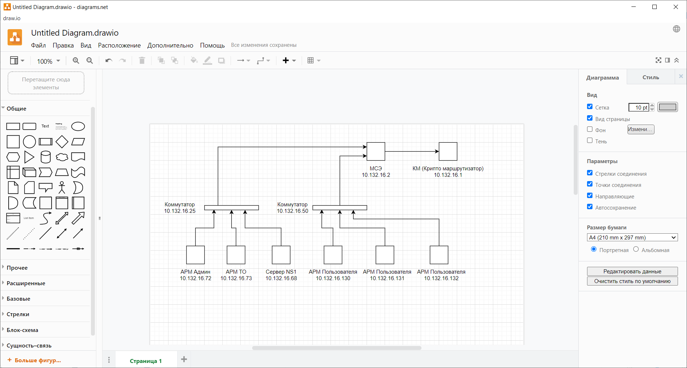

# Домашнее задание к занятию "3.8. Компьютерные сети, лекция 3"

1. Подключитесь к публичному маршрутизатору в интернет. Найдите маршрут к вашему публичному IP
```
telnet route-views.routeviews.org
Username: rviews
show ip route x.x.x.x/32
show bgp x.x.x.x/32
```
***Ответ:***

```
route-views>show ip route 178.67.198.233
Routing entry for 178.67.196.0/22
  Known via "bgp 6447", distance 20, metric 0
  Tag 2497, type external
  Last update from 202.232.0.2 4w3d ago
  Routing Descriptor Blocks:
  * 202.232.0.2, from 202.232.0.2, 4w3d ago
      Route metric is 0, traffic share count is 1
      AS Hops 2
      Route tag 2497
      MPLS label: none
```

```
route-views>show bgp 178.67.198.233
BGP routing table entry for 178.67.196.0/22, version 978746185
Paths: (24 available, best #19, table default)
  Not advertised to any peer
  Refresh Epoch 1
  20912 3257 12389
    212.66.96.126 from 212.66.96.126 (212.66.96.126)
      Origin IGP, localpref 100, valid, external
      Community: 3257:4000 3257:8794 3257:50001 3257:50110 3257:54900 3257:54901 20912:65004
      path 7FE0AE164CB0 RPKI State valid
      rx pathid: 0, tx pathid: 0
  Refresh Epoch 1
  7660 2516 12389
    203.181.248.168 from 203.181.248.168 (203.181.248.168)
      Origin IGP, localpref 100, valid, external
      Community: 2516:1050 7660:9001
      path 7FE04B95F1F8 RPKI State valid
      rx pathid: 0, tx pathid: 0
  Refresh Epoch 1
  3267 1299 12389
    194.85.40.15 from 194.85.40.15 (185.141.126.1)
      Origin IGP, metric 0, localpref 100, valid, external
      path 7FE10847B8E0 RPKI State valid
      rx pathid: 0, tx pathid: 0
  Refresh Epoch 1
  53767 174 174 1299 12389
    162.251.163.2 from 162.251.163.2 (162.251.162.3)
      Origin IGP, localpref 100, valid, external
      Community: 174:21000 174:22013 53767:5000
      path 7FE0D3AD6C60 RPKI State valid
      rx pathid: 0, tx pathid: 0
  Refresh Epoch 1
  3356 12389
    4.68.4.46 from 4.68.4.46 (4.69.184.201)
      Origin IGP, metric 0, localpref 100, valid, external
      Community: 3356:2 3356:22 3356:100 3356:123 3356:501 3356:901 3356:2065
      path 7FE0E721DD28 RPKI State valid
      rx pathid: 0, tx pathid: 0
  Refresh Epoch 1
  3549 3356 12389
    208.51.134.254 from 208.51.134.254 (67.16.168.191)
      Origin IGP, metric 0, localpref 100, valid, external
      Community: 3356:2 3356:22 3356:100 3356:123 3356:501 3356:901 3356:2065 3549:2581 3549:30840
      path 7FE0A8E73658 RPKI State valid
      rx pathid: 0, tx pathid: 0
  Refresh Epoch 1
  701 1273 12389
    137.39.3.55 from 137.39.3.55 (137.39.3.55)
      Origin IGP, localpref 100, valid, external
      path 7FE0DD1D88A8 RPKI State valid
      rx pathid: 0, tx pathid: 0
  Refresh Epoch 1
  7018 1299 12389
    12.0.1.63 from 12.0.1.63 (12.0.1.63)
      Origin IGP, localpref 100, valid, external
      Community: 7018:5000 7018:37232
      path 7FE11DED9708 RPKI State valid
      rx pathid: 0, tx pathid: 0
  Refresh Epoch 1
  101 3356 12389
    209.124.176.223 from 209.124.176.223 (209.124.176.223)
      Origin IGP, localpref 100, valid, external
      Community: 101:20100 101:20110 101:22100 3356:2 3356:22 3356:100 3356:123 3356:501 3356:901 3356:2065
      Extended Community: RT:101:22100
      path 7FE104BC7B58 RPKI State valid
      rx pathid: 0, tx pathid: 0
  Refresh Epoch 1
  1221 4637 12389
    203.62.252.83 from 203.62.252.83 (203.62.252.83)
      Origin IGP, localpref 100, valid, external
      path 7FE0FB9CB9B8 RPKI State valid
      rx pathid: 0, tx pathid: 0
  Refresh Epoch 1
  3333 1103 12389
    193.0.0.56 from 193.0.0.56 (193.0.0.56)
      Origin IGP, localpref 100, valid, external
      path 7FE131365F58 RPKI State valid
      rx pathid: 0, tx pathid: 0
  Refresh Epoch 1
  57866 1299 12389
    37.139.139.17 from 37.139.139.17 (37.139.139.17)
      Origin IGP, metric 0, localpref 100, valid, external
      Community: 1299:30000 57866:100 57866:101 57866:501
      path 7FE03C42FEF8 RPKI State valid
      rx pathid: 0, tx pathid: 0
  Refresh Epoch 1
  852 3356 12389
    154.11.12.212 from 154.11.12.212 (96.1.209.43)
      Origin IGP, metric 0, localpref 100, valid, external
      path 7FE109BBB8A0 RPKI State valid
      rx pathid: 0, tx pathid: 0
  Refresh Epoch 2
  3303 12389
    217.192.89.50 from 217.192.89.50 (138.187.128.158)
      Origin IGP, localpref 100, valid, external
      Community: 3303:1004 3303:1006 3303:1030 3303:3056
      path 7FE0C974BE30 RPKI State valid
      rx pathid: 0, tx pathid: 0
  Refresh Epoch 1
  3257 12389
    89.149.178.10 from 89.149.178.10 (213.200.83.26)
      Origin IGP, metric 10, localpref 100, valid, external
      Community: 3257:4000 3257:8794 3257:50001 3257:50110 3257:54900 3257:54901
      path 7FE155074530 RPKI State valid
      rx pathid: 0, tx pathid: 0
  Refresh Epoch 1
  20130 6939 12389
    140.192.8.16 from 140.192.8.16 (140.192.8.16)
      Origin IGP, localpref 100, valid, external
      path 7FE17EAE8008 RPKI State valid
      rx pathid: 0, tx pathid: 0
  Refresh Epoch 1
  3561 3910 3356 12389
    206.24.210.80 from 206.24.210.80 (206.24.210.80)
      Origin IGP, localpref 100, valid, external
      path 7FE02DE9B150 RPKI State valid
      rx pathid: 0, tx pathid: 0
  Refresh Epoch 1
  4901 6079 3257 12389
    162.250.137.254 from 162.250.137.254 (162.250.137.254)
      Origin IGP, localpref 100, valid, external
      Community: 65000:10100 65000:10300 65000:10400
      path 7FE117A5AC18 RPKI State valid
      rx pathid: 0, tx pathid: 0
  Refresh Epoch 1
  2497 12389
    202.232.0.2 from 202.232.0.2 (58.138.96.254)
      Origin IGP, localpref 100, valid, external, best
      path 7FE153E5D5C8 RPKI State valid
      rx pathid: 0, tx pathid: 0x0
  Refresh Epoch 1
  19214 3257 12389
    208.74.64.40 from 208.74.64.40 (208.74.64.40)
      Origin IGP, localpref 100, valid, external
      Community: 3257:4000 3257:8794 3257:50001 3257:50110 3257:54900 3257:54901
      path 7FE0A497C698 RPKI State valid
      rx pathid: 0, tx pathid: 0
  Refresh Epoch 1
  1351 6939 12389
    132.198.255.253 from 132.198.255.253 (132.198.255.253)
      Origin IGP, localpref 100, valid, external
      path 7FE15E81D0A8 RPKI State valid
      rx pathid: 0, tx pathid: 0
  Refresh Epoch 1
  6939 12389
    64.71.137.241 from 64.71.137.241 (216.218.252.164)
      Origin IGP, localpref 100, valid, external
      path 7FE0C3E51D38 RPKI State valid
      rx pathid: 0, tx pathid: 0
  Refresh Epoch 1
  49788 12552 12389
    91.218.184.60 from 91.218.184.60 (91.218.184.60)
      Origin IGP, localpref 100, valid, external
      Community: 12552:12000 12552:12100 12552:12101 12552:22000
      Extended Community: 0x43:100:1
      path 7FE0C3B53D18 RPKI State valid
      rx pathid: 0, tx pathid: 0
  Refresh Epoch 4
  8283 1299 12389
    94.142.247.3 from 94.142.247.3 (94.142.247.3)
      Origin IGP, metric 0, localpref 100, valid, external
      Community: 1299:30000 8283:1 8283:101 8283:103
      unknown transitive attribute: flag 0xE0 type 0x20 length 0x24
        value 0000 205B 0000 0000 0000 0001 0000 205B
              0000 0005 0000 0001 0000 205B 0000 0005
              0000 0003
      path 7FE033E81148 RPKI State valid
      rx pathid: 0, tx pathid: 0
```

2. Создайте dummy0 интерфейс в Ubuntu. Добавьте несколько статических маршрутов. Проверьте таблицу маршрутизации.

***Ответ:***
```
# cat /etc/network/interfaces

# interfaces(5) file used by ifup(8) and ifdown(8)
# Include files from /etc/network/interfaces.d:
#source-directory /etc/network/interfaces.d

auto dummy0
allow-hotplug dummy0
iface dummy0 inet static
        address 10.2.2.2/24
        pre-up ip link add dummy0 type dummy
        post-down ip link del dummy0

auto dummy0:0
iface dummy0:0 inet static
        address 10.2.2.3/24
```

```
# routel
         target            gateway          source    proto    scope    dev tbl
/usr/bin/routel: 48: shift: can't shift that many
        default        172.20.10.1                     dhcp          enp0s3
      10.2.2.0/ 24                        10.2.2.2   kernel     link dummy0
   169.254.0.0/ 16                                              link enp0s3
    172.17.0.0/ 16                      172.17.0.1   kernel     linkdocker0
   172.20.10.0/ 28                     172.20.10.2   kernel     link enp0s3
       10.2.2.0          broadcast        10.2.2.2   kernel     link dummy0 local
       10.2.2.2              local        10.2.2.2   kernel     host dummy1 local
       10.2.2.2              local        10.2.2.2   kernel     host dummy2 local
       10.2.2.2              local        10.2.2.2   kernel     host dummy3 local
       10.2.2.2              local        10.2.2.2   kernel     host dummy0 local
       10.2.2.3              local        10.2.2.2   kernel     host dummy0 local
     10.2.2.255          broadcast        10.2.2.2   kernel     link dummy0 local
      127.0.0.0          broadcast       127.0.0.1   kernel     link     lo local
     127.0.0.0/ 8            local       127.0.0.1   kernel     host     lo local
      127.0.0.1              local       127.0.0.1   kernel     host     lo local
127.255.255.255          broadcast       127.0.0.1   kernel     link     lo local
     172.17.0.0          broadcast      172.17.0.1   kernel     linkdocker0 local
     172.17.0.1              local      172.17.0.1   kernel     hostdocker0 local
 172.17.255.255          broadcast      172.17.0.1   kernel     linkdocker0 local
    172.20.10.0          broadcast     172.20.10.2   kernel     link enp0s3 local
    172.20.10.2              local     172.20.10.2   kernel     host enp0s3 local
   172.20.10.15          broadcast     172.20.10.2   kernel     link enp0s3 local
            ::1                                      kernel              lo
        fe80::/ 64                                   kernel          enp0s3
        fe80::/ 64                                   kernel          dummy0
            ::1              local                   kernel              lo local
fe80::d5c0:257c:86db:cc62              local                   kernel          enp0s3 local
fe80::e467:a5ff:fe07:1822              local                   kernel          dummy0 local
```

3. Проверьте открытые TCP порты в Ubuntu, какие протоколы и приложения используют эти порты? Приведите несколько примеров.

***Ответ:***
```
# ss -tp
State                      Recv-Q                      Send-Q                                             Local Address:Port                                             Peer Address:Port                      Process
ESTAB                      0                           36                                                   172.20.10.2:ssh                                               172.20.10.4:1056                       users:(("sshd",pid=3025,fd=4),("sshd",pid=2809,fd=4))
```

4. Проверьте используемые UDP сокеты в Ubuntu, какие протоколы и приложения используют эти порты?

***Ответ:***
```
# ss -uap
State                  Recv-Q                 Send-Q                                      Local Address:Port                                   Peer Address:Port                  Process
UNCONN                 0                      0                                           127.0.0.53%lo:domain                                      0.0.0.0:*                      users:(("systemd-resolve",pid=558,fd=12))
ESTAB                  0                      0                                      172.20.10.2%enp0s3:bootpc                                  172.20.10.1:bootps                 users:(("NetworkManager",pid=651,fd=23))
UNCONN                 0                      0                                                 0.0.0.0:34893                                       0.0.0.0:*                      users:(("avahi-daemon",pid=647,fd=14))
UNCONN                 0                      0                                                 0.0.0.0:631                                         0.0.0.0:*                      users:(("cups-browsed",pid=838,fd=7))
UNCONN                 0                      0                                                 0.0.0.0:mdns                                        0.0.0.0:*                      users:(("avahi-daemon",pid=647,fd=12))
UNCONN                 0                      0                                                    [::]:55877                                          [::]:*                      users:(("avahi-daemon",pid=647,fd=15))
UNCONN                 0                      0                                                    [::]:mdns                                           [::]:*                      users:(("avahi-daemon",pid=647,fd=13))
```

5. Используя diagrams.net, создайте L3 диаграмму вашей домашней сети или любой другой сети, с которой вы работали.

***Ответ:***



