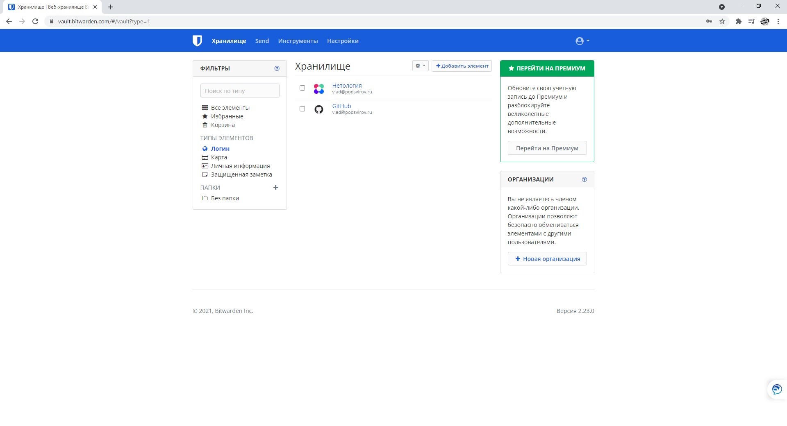
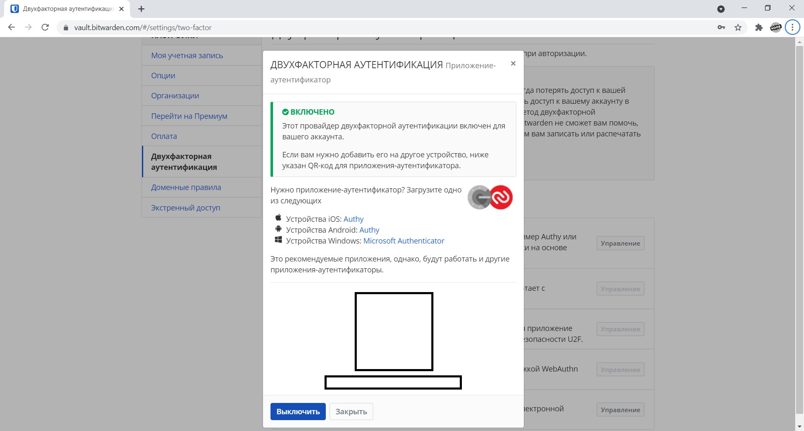
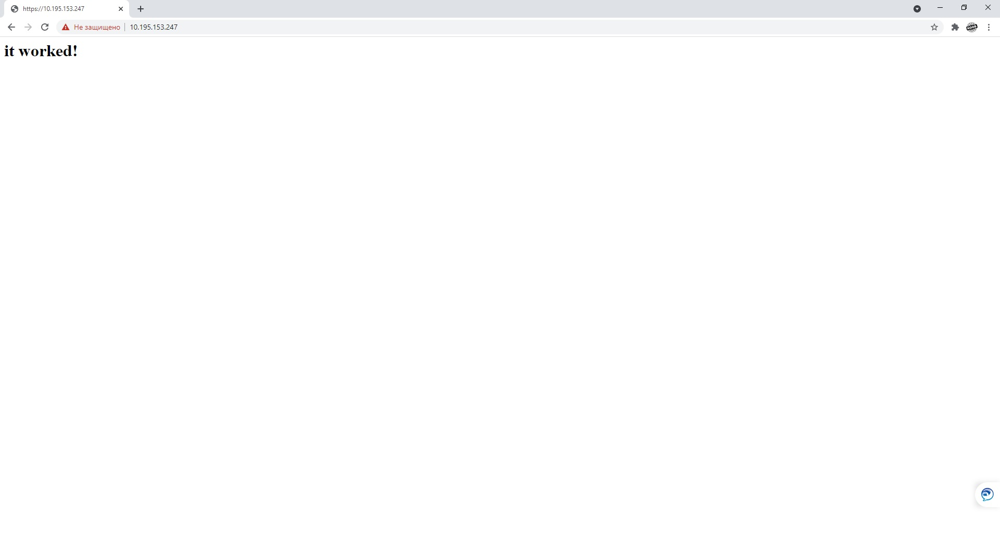
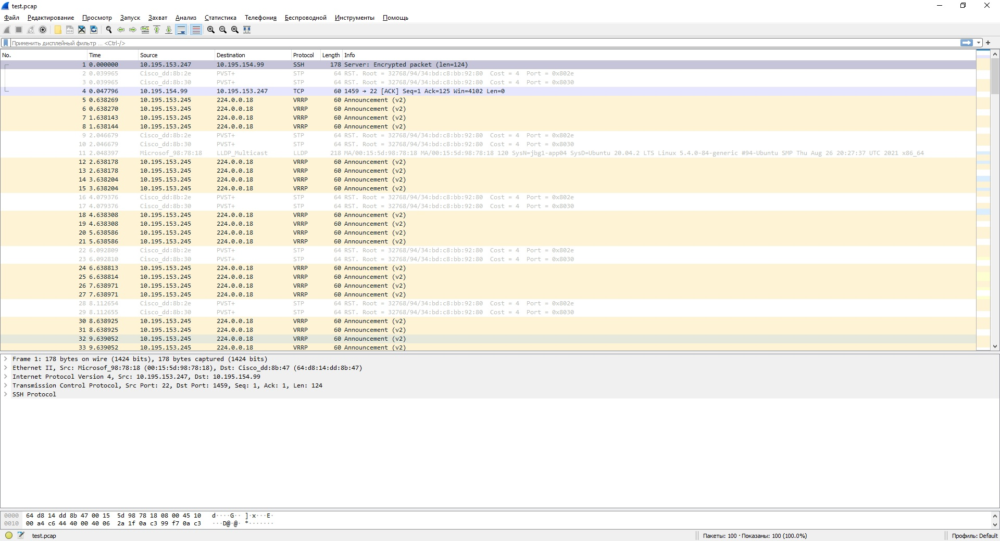

# Домашнее задание к занятию "3.9. Элементы безопасности информационных систем"

1. Установите Bitwarden плагин для браузера. Зарегестрируйтесь и сохраните несколько паролей.

***Ответ:***



2. Установите Google authenticator на мобильный телефон. Настройте вход в Bitwarden акаунт через Google authenticator OTP.

***Ответ:***



3. Установите apache2, сгенерируйте самоподписанный сертификат, настройте тестовый сайт для работы по HTTPS.

***Ответ:***

```
# apt install apache2
# a2enmod ssl
# systemctl restart apache2

# openssl req -x509 -nodes -days 365 -newkey rsa:2048 \
-keyout /etc/ssl/private/apache-selfsigned.key \
-out /etc/ssl/certs/apache-selfsigned.crt \
-subj "/C=RU/ST=Moscow/L=Moscow/O=Company Name/OU=Org/CN=www.example.com"

# cat /etc/apache2/sites-available/your_domain_or_ip.conf
<VirtualHost *:443>
   ServerName your_domain_or_ip
   DocumentRoot /var/www/your_domain_or_ip
   
   SSLEngine on
   SSLCertificateFile /etc/ssl/certs/apache-selfsigned.crt
   SSLCertificateKeyFile /etc/ssl/private/apache-selfsigned.key
</VirtualHost>

# mkdir /var/www/your_domain_or_ip
# cat /var/www/your_domain_or_ip/index.html
<h1>it worked!</h1>

# a2ensite your_domain_or_ip.conf
# apache2ctl configtest
# systemctl reload apache2

```
***Исправлено:***
```
# openssl req -x509 -nodes -days 365 -newkey rsa:2048 \
-keyout /etc/ssl/private/apache-selfsigned.key \
-out /etc/ssl/certs/apache-selfsigned.crt \
-subj "/C=RU/ST=Moscow/L=Moscow/O=Company Name/OU=Org/CN=10.195.153.247"

# cat /etc/apache2/sites-available/test.conf
<VirtualHost *:443>
   ServerName 10.195.153.247
   DocumentRoot /var/www/test
   
   SSLEngine on
   SSLCertificateFile /etc/ssl/certs/apache-selfsigned.crt
   SSLCertificateKeyFile /etc/ssl/private/apache-selfsigned.key
</VirtualHost>

# mkdir /var/www/test
# cat /var/www/test/index.html
<h1>it worked!</h1>
```
Дале в поисковике ввожу: https://10.195.153.247 (Google Chrome ругается так как это самоподписанный сертификат, но все же работает)




4. Проверьте на TLS уязвимости произвольный сайт в интернете.

***Ответ:***
```
# cd /opt/
# git clone --depth 1 https://github.com/drwetter/testssl.sh.git
# cd testssl.sh/
# ./testssl.sh -U --sneaky https://www.interrao.ru/

 Testing vulnerabilities

 Heartbleed (CVE-2014-0160)                not vulnerable (OK), no heartbeat extension
 CCS (CVE-2014-0224)                       not vulnerable (OK)
 Ticketbleed (CVE-2016-9244), experiment.  not vulnerable (OK)
 ROBOT                                     not vulnerable (OK)
 Secure Renegotiation (RFC 5746)           supported (OK)
 Secure Client-Initiated Renegotiation     not vulnerable (OK)
 CRIME, TLS (CVE-2012-4929)                not vulnerable (OK)
 BREACH (CVE-2013-3587)                    potentially NOT ok, "br gzip" HTTP compression detected. - only supplied "/" tested
                                           Can be ignored for static pages or if no secrets in the page
 POODLE, SSL (CVE-2014-3566)               not vulnerable (OK)
 TLS_FALLBACK_SCSV (RFC 7507)              Downgrade attack prevention supported (OK)
 SWEET32 (CVE-2016-2183, CVE-2016-6329)    not vulnerable (OK)
 FREAK (CVE-2015-0204)                     not vulnerable (OK)
 DROWN (CVE-2016-0800, CVE-2016-0703)      not vulnerable on this host and port (OK)
                                           make sure you don't use this certificate elsewhere with SSLv2 enabled services
                                           https://censys.io/ipv4?q=E1D3B8CD88E71D6FF5B7C38E8282C3016C6D72803FD76329AD0D7EB748D3A8C7 could help you to find out
 LOGJAM (CVE-2015-4000), experimental      not vulnerable (OK): no DH EXPORT ciphers, no common prime detected
 BEAST (CVE-2011-3389)                     TLS1: ECDHE-RSA-AES256-SHA DHE-RSA-AES256-SHA ECDHE-RSA-AES128-SHA DHE-RSA-AES128-SHA AES256-SHA AES128-SHA
                                           VULNERABLE -- but also supports higher protocols  TLSv1.1 TLSv1.2 (likely mitigated)
 LUCKY13 (CVE-2013-0169), experimental     potentially VULNERABLE, uses cipher block chaining (CBC) ciphers with TLS. Check patches
 Winshock (CVE-2014-6321), experimental    not vulnerable (OK) - ARIA, CHACHA or CCM ciphers found
 RC4 (CVE-2013-2566, CVE-2015-2808)        no RC4 ciphers detected (OK)
```

5. Установите на Ubuntu ssh сервер, сгенерируйте новый приватный ключ. Скопируйте свой публичный ключ на другой сервер. Подключитесь к серверу по SSH-ключу.

***Ответ:***
```
# apt install openssh-server
# systemctl start sshd.service
# systemctl enable sshd.service

# ssh-keygen

# ssh-copy-id zabbix@10.195.153.200

Теперь с сервера 10.195.153.200, могу подключаться к серверу без пароля:

$ ssh 'admsec@10.195.153.247'
admsec@jbg1-app04:~$
```

6. Переименуйте файлы ключей из задания 5. Настройте файл конфигурации SSH клиента, так чтобы вход на удаленный сервер осуществлялся по имени сервера.

***Ответ:***

```
# mv id_rsa id_server
# mv id_rsa.pub id_server.pub

# mkdir -p ~/.ssh && chmod 700 ~/.ssh
# touch ~/.ssh/config && chmod 600 ~/.ssh/config
# cat /root/.ssh/config
Host ns1
    HostName 10.195.153.247
    IdentityFile ~/.ssh/id_server.pub
    User admsec

Host *
    User default_username
    IdentityFile ~/.ssh/id_server
    Protocol 2

# ssh ns1
admsec@jbg1-app04:~$
```
7. Соберите дамп трафика утилитой tcpdump в формате pcap, 100 пакетов. Откройте файл pcap в Wireshark.

***Ответ:***
```
# tcpdump -w test.pcap -i eth0 -c 100
tcpdump: listening on eth0, link-type EN10MB (Ethernet), capture size 262144 bytes
100 packets captured
125 packets received by filter
0 packets dropped by kernel
#
```




----------------------------------------------------------

8*. Просканируйте хост scanme.nmap.org. Какие сервисы запущены?
```
Запущены: 
1) ssh (OpenSSH 6.6.1p1)
2) apache 2.4.7
3) На 2000 порту tcpwrapped
4) На 5060 порту tcpwrapped
5) На 8008 порту веб-сайт
6) На 9929 порту nping-echo
7) На 31337 порту tcpwrapped
```

***Ответ:***

9*. Установите и настройте фаервол ufw на web-сервер из задания 3. Откройте доступ снаружи только к портам 22,80,443

***Ответ:***
```
# apt install ufw

# ufw status
Status: inactive

# ufw allow from 10.195.154.99 to any port 22
# ufw allow from 10.195.154.0/24 to any port 80
# ufw allow from 10.195.154.0/24 to any port 443

22 порт открыл только для администратора 
```
